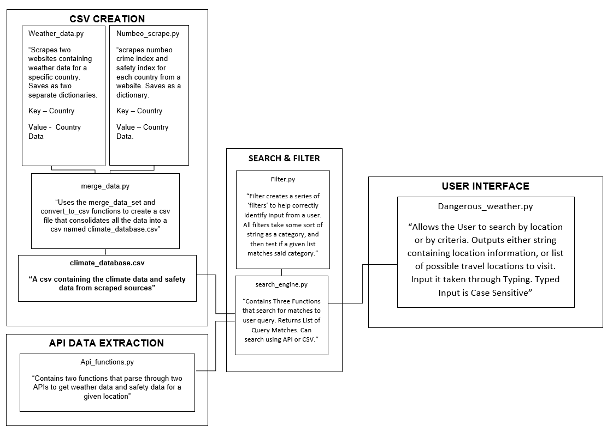
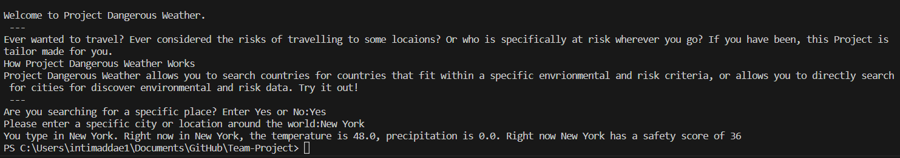
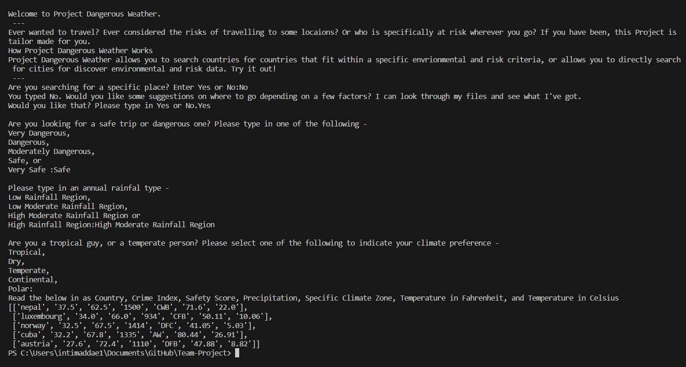

# Project Dangerous Weather
Have you ever been interested in 
## Team-Members
Immanuel Ntim-Addae

Travelling can be anxiety inducing for risk averse people. From the very first moments of boarding a plane to another country, to finally returning home in one piece, I am always worried. These worries range from flimsy concerns about luggage or hotel prices to fear of the criminal elements lurking in every location. 
My anxiety around travel inspired me to design Project Dangerous Weather. Project Dangerous Weather allows me to simplify my travel process just a little bit. The Project intends for a user to be able to get a list of recommended countries that fit specific criteria of weather and safety score. This was the minimum viable product. 
## User Instructions
To use Project Dangerous Weather, navigate to the GitHub Repository named Team-Project. Here, click on the file “dangerous_weather.py”. Follow the instructions in the file to get a list of countries, or details for a specific country. 
Project Evolution:
My Goal involved being able to filter through a series of search results to find a specific country that had those specific attributes. For example, I wanted to be able to search for a country with a Tropical Climate, a good safety score, and had low rainfall. However, during my research for the project, I found that the solution was not going to be easy. 
My first instinct was to attempt to find an API where I could simply grab the information I required. However, most APIs I encountered on my search focused on being able to obtain climate or safety data about a specific location. This was the opposite of what I wanted to do: I wanted to use climate and safety data to find locations. Using APIs was not going to work.

# Implementation


## CSV DEVELOPMENT
My new implementation idea (which became the final implementation method) now involved making my own database, saved as a csv, and navigating it to find matches. But how was I going to get the data? Enter Web Scraping.
Web Scraping is a method by which programmers can get raw data from a website. Using this raw data, they can “scrape” the site to get important information. Web Scraping was perfect for my project, as it allows me to choose any data source with a publicly accessible table of results on their webpage. For this project, I decided to scrape the following websites: 
Weather and Climate: https://weatherandclimate.com/countries 
Wikipedia Page for Annual Precipitation: https://en.wikipedia.org/wiki/List_of_countries_by_average_annual_precipitation 
Numbeo Safety Scores: https://www.numbeo.com/crime/rankings_by_country.jsp?title=2023-mid 
Scraping took much longer than expected. I (1) Failed to clearly define what I meant by a safety score, and therefore it took longer to find a website that contained what I was looking for, and (2) I did not predict consolidation difficulties. The following paragraph elaborates on problem (2).
Consolidation difficulties mainly came from the fact that the data sets were very different from one another. For example, one data set had all 196 countries plus over 50 world territories, while another set had only 183. I could not find data that all had the same countries and format, so I had to consistently debug code, looking out for Key Errors, Index Errors and so on. Going through this process, I only came out with 136 countries that had complete data on them. 
```python
#corrections for merging dataset
        if country_name == "the bahamas":
            country_name = "bahamas"
        if country_name == "cote d'ivoire":
            country_name = "ivory coast"
        if country_name == "czechia":
            country_name = "czech republic"
```

I consolidated all my data into a large csv file using the csv module. I considered using pandas at first, but stuck to the csv module and used a for loop for the process. 
## API USAGE
I then turned my attention to my API. One issue I had, like my csv creation issues, was that online sources lacked the information I desired. Many online API’s were not able to return a “safety score” as I originally envisioned. For my purposes, I decided to use Amadeus API. However, Amadeus API is still very incomplete, and only contains some largely known cities around the world. Additionally, finding the documentation for Amadeus Safety API was confusing. Other Amadeus APIs were quickly accessible, but not Safety API. The other API used to get weather data was easy to use because I had previously used it for an experiment. 
## SEARCH & FILTER
I then created two modules to deal with search functionality. This section took time, but I began to understand how to make such a search filter. I focused on using categorical variables as search options, not to dissuade users. This part of the process took a lot of trouble shooting. 
## USER INTERFACE
By the time I had to create the User Interface, I was running out of time. First, I had another exam I had not started studying for. Second, if I dedicated any more time to this project within the next two days, I would have lost my mind. I decided I needed to couch this Project and work on other aspects of my academics. Therefore, I quickly developed a small program that takes user input. It is, admittedly, very rigid and flawed. Output is not pretty, and this is a slightly disappointing result for all my hard work. 

By Country


By Filter


